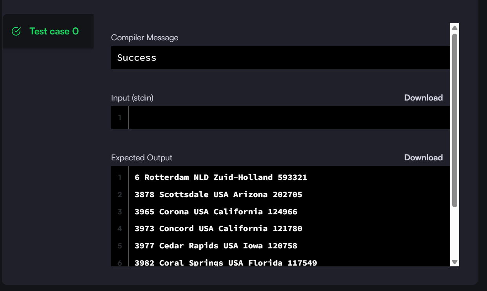
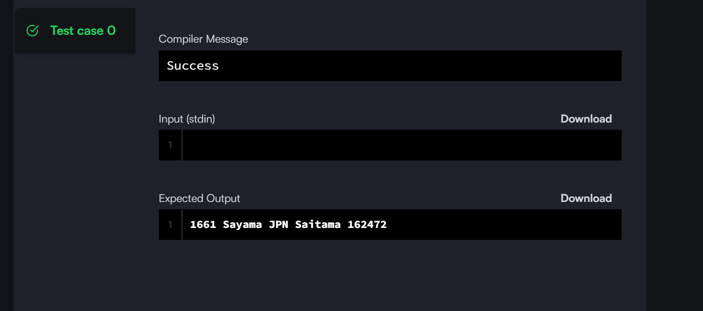
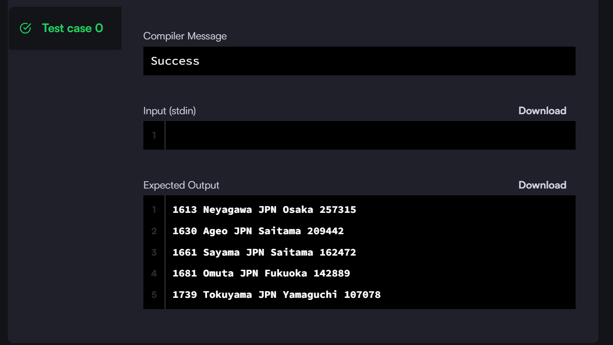
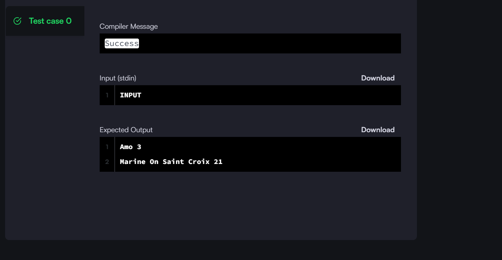

 
# DE003 Assignment

## 1. Select All : SQL Quey to fetch all details

This the solution code and screenshot

## Screenshot

## Solution code 
see [`Select ALL Solution`](01_Select.sql) for the code
## 2. Select By ID : SQL query to fetch details by ID

This the solution code and screenshot

## Screenshot

## Solution code 
see [`Select by id `](02_Select-By-ID.sql) for the code
## 3. Employee Names : SQL Query to list all employess names

This the solution code and screenshot

## Screenshot

## Solution code 
see [`Employee name `](03_employee.sql) for the code
## 4. Japanese Cities : Query to filter Japanese City

This the solution code and screenshot

## Screenshot

## Solution code 
see [`Japananese city `](04_Japansese_city.sql) for the code
## 5. Weather Observation Station 1 : SQL Query to list of city and state

This the solution code and screenshot

## Screenshot

## Solution code 
see [`Weather_Observation station 1`](05_Weather_obs.sql) for the code
## 6. Weather Observation Station 3 : Query a list of CITY names from STATION for cities that have an even ID number

This the solution code and screenshot

## Screenshot

## Solution code 
see [`Weather_Observation station 3`](06_Weather-Observation.sql) for the code

## 7. Weather Observation Station 4 : Find the difference between the total number of CITY entries in the table and the number of distinct CITY entries in the table.

This the solution code and screenshot

## Screenshot

## Solution code 
see [`Weather_Observation station 4`](07_Weather-Observation-Station-4%20.sql) for the code
 

## 8. Weather Observation Station 5 : Query the two cities in STATION with the shortest and longest CITY names, as well as their respective lengths

This the solution code and screenshot

## Screenshot

## Solution code 
see [`Weather_Observation-station 5`](08_Weather-Observation-Station-5.sql) for the code

## 9. Average Population : Query the average population for all cities in CITY, rounded down to the nearest integer.

This the solution code and screenshot

## Screenshot

## Solution code 
see [`Average population`](09_Average_population.sql) for the code

## 10. Average Population : Query the average population for all cities in CITY, rounded down to the nearest integer.

This the solution code and screenshot

## Screenshot

## Solution code 
see [`Average population`](10_Average-Population.sql) for the code